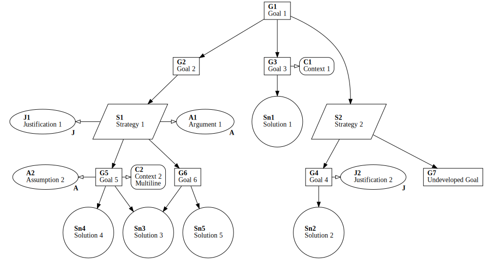

  

# gsn2x

This little program converts [Goal Structuring Notation](https://scsc.uk/gsn) in a YAML notation to the DOT format of [Graphviz](https://graphviz.org). From there it can be rendered to different graphic formats.

Graphviz dot is required to create an image from the output of this tool.

Feel free to use it and please let me know.

## Usage

On Windows you can just run:

    gsn2x.exe <yourgsnfile.yaml> | dot -Tpng > <yourgsnfile.png>

On other systems you can create a PNG like this:

    gsn2x <yourgsnfile.yaml> | dot -Tpng > <yourgsnfile.png>

If a second optional argument is provided, the output is not written to stdout, but to the file named by the second argument.
If called with option `-c` or `--check` the input file is only checked for validity, but the resulting graph is not written.
    
## Syntax in YAML

The following Goal Structuring Notation (GSN) elements are supported:
 - Goal (G), 
 - Assumption (A), 
 - Justification (J), 
 - Solution (Sn),
 - Context (C), and
 - Strategy (S)

Every element is defined by a prefix (as shown in the list above) and a number.
Actually, the number can be an arbitrary identifier then.

The (optional) `supportedBy` gives a list of the supporting arguments. Thus, Goal, Strategy and Solution can be listed here.

The (optional) `inContextOf` links Justifications, Contexts or Assumptions. 

Every element may have an optional `url` attribute that will be used by Graphviz accordingly for a node in the graph.
This should support finding information more easily. Please note the supported output formats by Graphviz.

Goals and Strategies can be undeveloped i.e., without supporting Goals, Strategies or Solutions.
These elements should marked with `undeveloped: true`, otherwise validation will emit warnings.

### Example

    G1:
      text: This is a Goal
      supportedBy: [S1]
      inContextOf: [C1]
    
    S1:
      text: This is a Strategy
    
    C1: 
      text: This is a Context

Please see example.gsn.yaml for an example of the used syntax.

## Validation checks

The tool automatically performs the following validation checks on the input YAML:

 - There is only one top-level element (G,S,C,J,A,Sn) unreferenced. 
 - All referenced elements (`supportedBy` and `inContextOf`) exist.
 - All IDs start with a known prefix.
 - All Goals and Strategies are either marked with `undeveloped: true` or have supporting Goals, Strategies or Solutions.

Uniqueness of keys is automatically enforced by the YAML format.

Error messages are printed to stderr.
